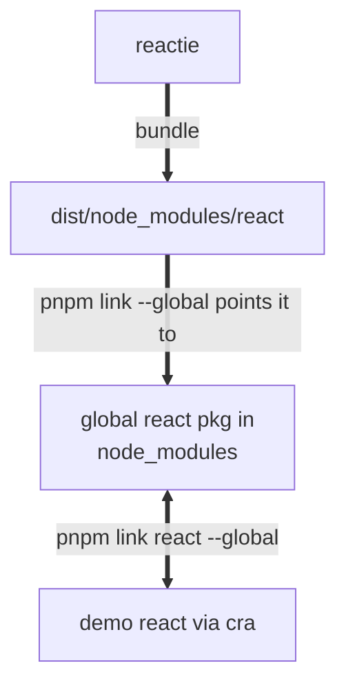

# Init project

- Init pnpm

```sh
nvm use
pnpm init
```

- init `pnpm-workspace.yaml`

- Add ESLinit

```sh
pnpm i eslint -D -w

# init eslint config
npx eslint --init

# add eslint plugin for ts
pnpm i -D -w @typescript-eslint/eslint-plugin
```

- Add Prettier

```sh
pnpm i prettier -D -w
```

- Add prettier config `.prettier.json`
  Also, to avoid it conflicts with eslint, need to integrate prettier into eslint:

```sh
pnpm i eslint-config-prettier eslint-plugin-prettier -D -w
```

Add this to `package.json`:

```json
"script": {
    "lint": "eslint --ext .js,.ts,.jsx,.tsx --fix --quiet ./packages",
}

```

- Add Husky

```sh
pnpm add husky@8  -D -w
npx husky install

npx husky add .husky/pre-commit "pmpm lint"
```

- Add commitlint

```sh
pnpm i -D -w commitlint  @commitlint/cli @commitlint/config-conventional
```

Create `.commitlintrc.js`:

```js
module.exports = {
	extends: ['@commitlint/config-conventional'],
}
```

Integrate commitlint into husky with conventional commit rules:

```sh
npx husky add .husky/commit-msg "npx --no-install commitlint -e $HUSKY_GIT_PARAMS"
```

<type>: <subject>
Common types are:

| Type     | Description                                                                                            |
| -------- | ------------------------------------------------------------------------------------------------------ |
| feat     | A new feature                                                                                          |
| fix      | A bug fix                                                                                              |
| docs     | Documentation only changes                                                                             |
| style    | Changes that do not affect the meaning of the code (white-space, formatting, missing semi-colons, etc) |
| chore    | Non-functional changes                                                                                 |
| refactor | A code change that neither fixes a bug nor adds a feature                                              |
| test     | Adding missing tests or correcting existing tests                                                      |
| perf     | A code change that improves performance                                                                |
| ci       | Changes to our CI configuration files and scripts                                                      |

- Add TS config

```sh
pnpm i typescript -D -w
```

Add `tsconfig.json`:

```json
{
	"compileOnSave": true,
	"compilerOptions": {
		"target": "ESNext",
		"useDefineForClassFields": true,
		"module": "ESNext",
		"lib": ["ESNext", "DOM"],
		"moduleResolution": "Node",
		"strict": true,
		"sourceMap": true,
		"resolveJsonModule": true,
		"isolatedModules": true,
		"esModuleInterop": true,
		"noEmit": true,
		"noUnusedLocals": true,
		"noUnusedParameters": true,
		"noImplicitReturns": false,
		"skipLibCheck": true,
		"baseUrl": "./packages"
	}
}
```

- Install Rollup

```sh
pnpm i -D -w rollup
```

# JSX compilation

The structure of react project is as follows:
| Package | Description |
|-------------------|----------------------------------------------------------------------------------------------|
| react | Public functions that are irrelevant to the host environment, such as `react.createElement` |
| react-reconciler | React core logic, irrelevant to the host environment |
| react-dom | React host environment, such as `react-dom`, `react-node-renderer` |
| shared | Public utils |

- create `packages/react`:

```sh
cd packages/react

pnpm init
```

In `packages/react/package.json`, add:

```json
{
	"name": "react",
	"version": "0.0.1",
	"module": "index.ts" // Rollup supports ESM module by nature
}
```

## Implement `React.createElement` method

What is JSX compilation?
JSX is a syntax extension for JavaScript that allows you to write HTML-like code within JavaScript. It is commonly used in React to describe the UI structure. JSX needs to be transformed into JavaScript function calls, which React can understand and render. It includes:

- Compile time: Parsing the JSX syntax(handled by babel already✅)

Before React 17 (runtime: classic):

```
<div>123</div>

===>

/*#__PURE__*/React.createElement("div", null, "123");
```

After React 17 (runtime: automatic):

```
<div>123</div>

===>

import { jsx as _jsx } from "react/jsx-runtime";
/*#__PURE__*/_jsx("div", {
  children: "123"
});
```

- Runtime: calling `jsx` function or `createElement` function, which we want to implement🛠️:
  - Implement jsx function
  - Implement bundling
  - Implement an environment to test the bundling result

## Implement bundling

Since we've created three functions:

- jsxDEV
- jsx
- React.createElement

We need to bundle and output three files:

- `react/jsx-dev-runtime.js` (dev)/packages
- `react/jsx-runtime.js` (prd)
- React

Create `scripts/rollup/react.config.js`(config for React package).

Add dependencies:

```sh
pnpm i -D -w rollup-plugin-typescript2 @rollup/plugin-commonjs

// remove old dist before build
pnpm i -D -w rimraf

// Need a lin to generate package.json in build dist
pnpm i -D -w  rollup-plugin-generate-package-json
```

## To test the bundling result



### pnpm link

Point the global react package to the bundled react package:

```sh
# Go to the dist folder of the bundled react package
cd dist/node_modules

pnpm link --global


/Users/aaron/Library/pnpm/global/5:
+ react 1.0.0 <- ../../../../Documents/dev/me/reactie/dist/node_modules/react

```

Create a demo react app to test the bundling result:

```sh
pnpm create vite react-demo --template react
cd react demo

```

# Now you can use the bundled react package in the demo app

```sh
pnpm link react --global

pnpm dev
```
